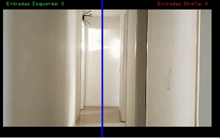

# Detectando Movimentos com OpenCV 4.1.1

 O objetivo deste projeto é realizar alguns estudos/testes na área de visão computacional, especialmente na detecção de movimentos em um vídeo. 

 Nesse estudo vamos utilizar a biblioteca <b> OpenCV (Open Source Computer Vision Library) versão 4.1.1</b> para realizar alguns testes de detecção de movimentos. 

 A análise que vamos realizar será a contagem de entradas ocorridas nas portas localizadas na esquerda e direita do vídeo. 

 Os exemplos utilizados neste estudo foram baseados nos sites: 

https://opencv-python-tutroals.readthedocs.io/en/latest/py_tutorials/py_tutorials.html

https://www.pyimagesearch.com/2015/05/25/basic-motion-detection-and-tracking-with-python-and-opencv/

Para saber mais sobre o OpenCV

https://opencv.org/

https://pt.wikipedia.org/wiki/OpenCV

## Informação sobre os arquivos:

 <b>detecta_movimento.py </b> - Esse é o programa principal que realiza a detecção de movimentos em um vídeo. 

##### Exemplo de Movimento detectado:

